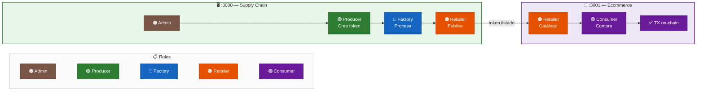
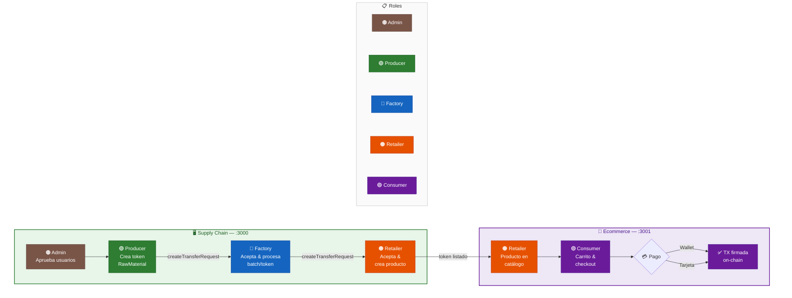
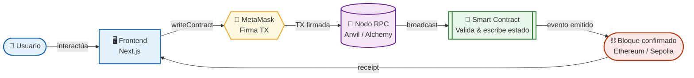
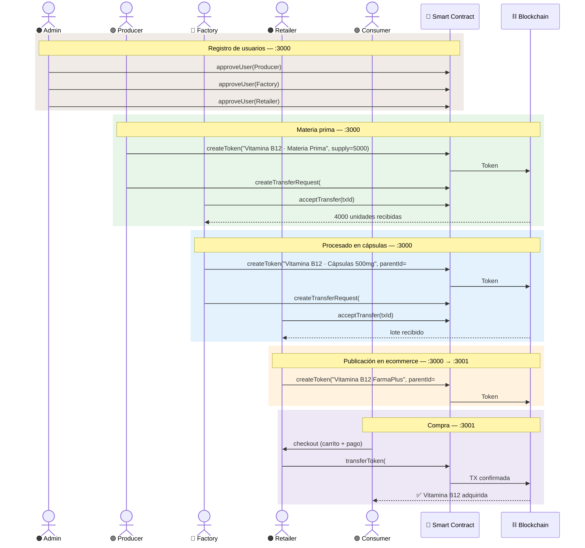

# Diagramas — Logistics PFM

Colección de diagramas Mermaid del proyecto. Cubren arquitectura lógica,
flujo de transferencia de tokens, interacción entre capas y ciclo de vida de un producto.

---

## 1. Arquitectura lógica

Vista general del sistema. Muestra los dos entornos web (`:3000` Supply Chain y `:3001` Ecommerce),
los roles involucrados en cada uno y cómo el token fluye desde el Retailer en la gestión interna
hasta el catálogo público de FarmaPlus.

---

## 2. Flujo de transferencia de tokens por rol

Detalla paso a paso cómo un token recorre los roles desde su creación. El Admin habilita a los
actores, el Producer origina el token, la Factory lo procesa y el Retailer lo publica. En `:3001`
el Consumer puede pagar con wallet MetaMask o tarjeta simulada.

---

## 3. Flujo de proceso con actores y capas técnicas

Ciclo completo de una transacción de escritura visto desde la capa técnica. El usuario dispara
la acción en el Frontend (wagmi), MetaMask firma, el Nodo RPC hace el broadcast, el Smart Contract
valida y persiste el estado en la Blockchain, y el `receipt` regresa al Frontend para actualizar la UI.

---

## 4. Flujo simplificado de transferencia de tokens

```mermaid
flowchart LR
    subgraph LEGEND["📋 Roles"]
        direction LR
        L1["🟤 Admin"]:::admin ~~~ L2["🟢 Producer"]:::producer ~~~ L3["🔵 Factory"]:::factory ~~~ L4["🟠 Retailer"]:::retailer ~~~ L5["🟣 Consumer"]:::consumer
    end

    subgraph PORT3000["🖥️ :3000 — Supply Chain"]
        A1["🟤 Admin"]:::admin --> P1["🟢 Producer\nCrea token"]:::producer
        P1 -->|"createTransferRequest"| F1["🔵 Factory\nAcepta & procesa"]:::factory
        F1 -->|"createTransferRequest"| R1["🟠 Retailer\nPublica"]:::retailer
    end

    subgraph PORT3001["🛒 :3001 — Ecommerce"]
        E1["🟠 Retailer\nCatálogo"]:::retailer --> E2["🟣 Consumer\nCompra"]:::consumer
        E2 --> E3{"💳 Pago"}
        E3 -->|"Wallet"| E4["✅ TX on-chain"]:::consumer
        E3 -->|"Tarjeta"| E4
    end

    LEGEND ~~~ PORT3000
    R1 -->|"token listado"| E1

    classDef admin    fill:#795548,color:#fff,stroke:#5d4037
    classDef producer fill:#2e7d32,color:#fff,stroke:#1b5e20
    classDef factory  fill:#1565c0,color:#fff,stroke:#0d47a1
    classDef retailer fill:#e65100,color:#fff,stroke:#bf360c
    classDef consumer fill:#6a1b9a,color:#fff,stroke:#4a148c

    style PORT3000 fill:#e8f5e9,stroke:#2e7d32,stroke-width:2px
    style PORT3001 fill:#ede7f6,stroke:#6a1b9a,stroke-width:2px
    style LEGEND   fill:#fafafa,stroke:#bdbdbd,stroke-width:1px
```

Versión compacta del flujo completo. Útil como referencia rápida: muestra los dos entornos,
los nombres de las funciones clave del contrato (`createTransferRequest`) y los dos métodos
de pago disponibles en el checkout.

---

## 5. Diagrama de secuencia — Vitamina B12

Ciclo de vida completo de la Vitamina B12 con interacciones temporales entre actores.
Muestra el orden exacto de las llamadas al Smart Contract: aprobación de usuarios, creación
encadenada de tokens con `parentId` (trazabilidad), transferencias entre roles y compra final
por el Consumer en `:3001`. Cada bloque coloreado representa una fase del proceso.
